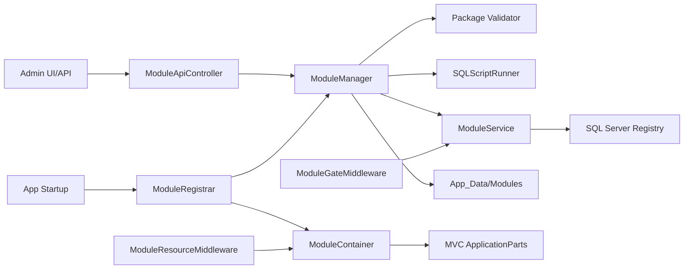
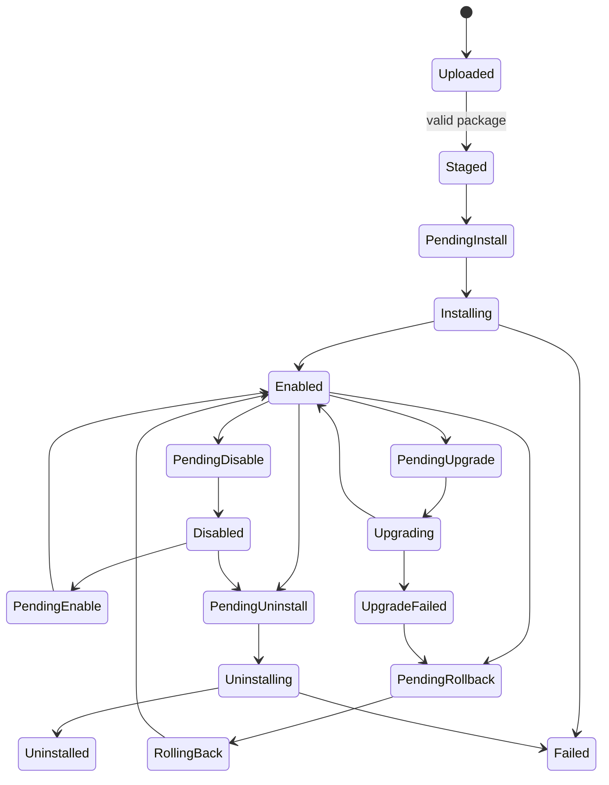
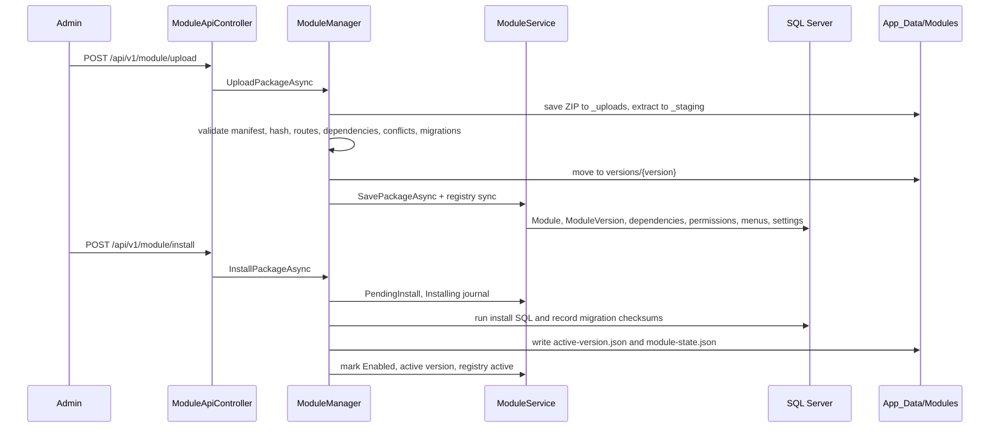
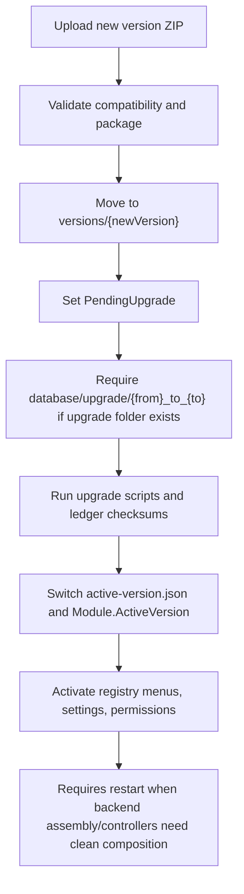
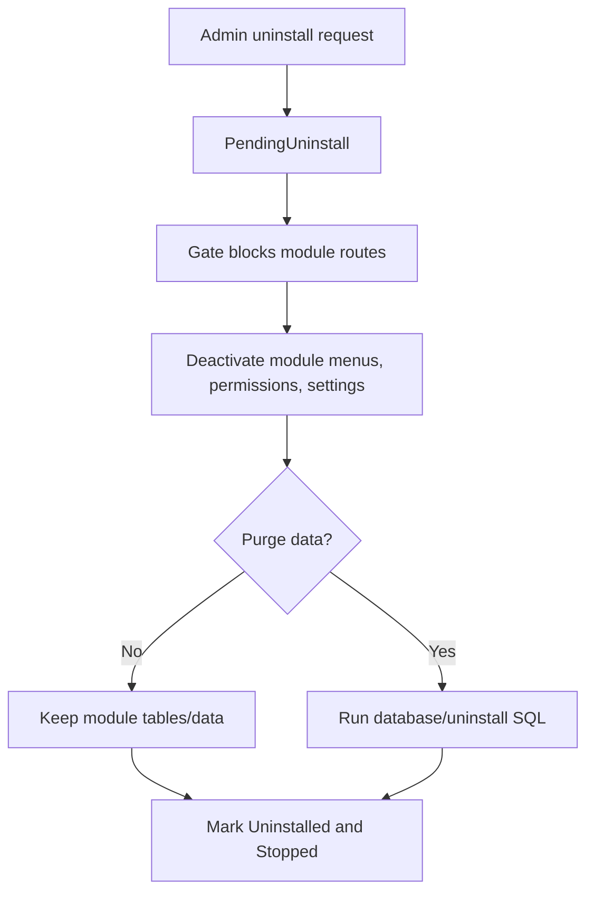

# Module Management Blueprint

Date: 2026-06-20

This document records the production module-management implementation added to YO Framework: package contract, lifecycle, storage layout, database registry, admin API, frontend serving, tests, and the exact files touched.

## Scope

The CMS module engine now owns:

- Module ZIP upload and staged validation.
- Immutable version storage under `App_Data/Modules`.
- Durable module registry, package version registry, dependencies, permissions, menus, settings, operation journal, and migration ledger.
- Install, enable, disable, upgrade, rollback, and uninstall operations.
- SQL migration execution with checksum ledger and `GO` batch splitting.
- Startup discovery for built-in modules and active packaged modules.
- MVC ApplicationPart registration for active package controllers after restart.
- Frontend asset serving from active package `frontend` directories.
- A module request gate for module API/UI routes during disabled, uninstalling, installing, and upgrading states.
- Admin API endpoints for package upload and lifecycle operations.
- Test coverage for install, upgrade, uninstall, unsafe ZIP rejection, and circular dependency rejection.

The installable module owns:

- `module.json` metadata.
- API controllers, services, DTOs, and backend assembly.
- SQL install, upgrade, rollback, and uninstall scripts.
- React/static frontend assets.
- Menu, permission, dependency, setting, compatibility, package hash, signature, and health metadata declarations.

## Package Layout

```text
module.zip
|-- module.json
|-- backend/
|   |-- YangOne.Inventory.Module.dll
|   |-- YangOne.Inventory.Module.deps.json
|   `-- dependencies/
|-- database/
|   |-- install/
|   |   `-- 001_initial.sql
|   |-- upgrade/
|   |   `-- 1.0.0_to_1.1.0/
|   |-- rollback/
|   |   `-- 1.1.0_to_1.0.0/
|   `-- uninstall/
|       `-- purge.sql
`-- frontend/
    |-- index.html
    `-- assets/
```

## Immutable Storage

```text
App_Data/
`-- Modules/
    |-- _uploads/
    |-- _staging/
    `-- YangOne.Inventory/
        |-- versions/
        |   |-- 1.0.0/
        |   |-- 1.1.0/
        |   `-- 1.2.0/
        |-- active-version.json
        `-- module-state.json
```

No uploaded package overwrites a loaded DLL. Upload extracts to staging, validates there, then moves to an immutable `versions/{version}` folder.

## Runtime Architecture



## Lifecycle State



Runtime state is stored separately as `NotLoaded`, `Loading`, `Loaded`, `Stopping`, `Stopped`, or `Faulted` so database install state cannot be confused with assembly load status.

## Install Flow



## Upgrade Flow



## Uninstall Flow



## Database Registry

Fresh installs and upgraded databases now have the same module-management infrastructure:

- `Module`: existing module row extended with display name, module key, active/staged version, lifecycle/runtime state, package hash/path, manifest JSON, last operation/error, restart flag, enabled/disabled timestamps.
- `ModuleVersion`: accepted immutable package versions with manifest, package hash, version path, active flag, rollback eligibility.
- `ModuleOperationJournal`: audit trail for upload, install, enable, disable, upgrade, rollback, uninstall, and resume operations.
- `ModuleMigrationHistory`: SQL migration ledger with script hash and execution result.
- `ModuleDependency`: required dependency declarations.
- `ModulePermission`: manifest permission declarations.
- `ModuleMenu`: manifest menu declarations mapped to existing `Menu` rows.
- `ModuleSetting`: manifest setting declarations.

Stored procedures added:

- `usp_Module_GetAll.sql`
- `usp_ModuleOperationJournal_GetByModule.sql`
- `usp_ModuleManifestRegistry_GetByModule.sql`

## Admin API

Base route: `/api/v1/module`

- `GET /all`: paged module listing through existing CRUD style.
- `POST /upload`: multipart ZIP upload and validation.
- `POST /install`: built-in install or package install.
- `POST /enable`: enable and activate registry metadata.
- `POST /disable`: disable and hide/deactivate module metadata.
- `POST /upgrade`: run version-specific upgrade path and activate new version.
- `POST /rollback`: run version-specific rollback path and reactivate old immutable version.
- `POST /uninstall`: uninstall with optional `PurgeData`.
- `GET /{moduleName}/journal`: read operation history.

Module-owned API routes are expected under:

```text
/api/modules/{module-id}/v1/...
```

The validator rejects arbitrary top-level module prefixes when `ApiRoutePrefix` is declared.

## Frontend Serving

The existing framework route remains supported:

```text
/module/{module-id}/...
```

The immutable-version UI route is also supported for the active version:

```text
/modules/{module-id}/{version}/ui/...
```

Both paths are protected by `ModuleGateMiddleware` and serve files from the active `frontend` folder through `ModuleResourceMiddleware`.

## Validation Coverage

Package validation rejects or warns for:

- Missing `module.json`.
- Invalid module id or version.
- Missing entry assembly.
- Unsafe ZIP paths such as `../`.
- Forbidden executable/script extensions.
- Unsupported CMS version.
- Unsupported database provider.
- Missing required dependency or too-low dependency version.
- Circular dependency graph.
- Conflicting API route prefix.
- Conflicting manifest menu key.
- Invalid package hash.
- Missing signature when `ModuleManagement:RequireDigitalSignature` is true.
- Missing frontend entry point as a warning.

Upgrade and rollback reject missing version-specific migration routes when a migration folder exists.

## Change Map

Core module engine:

- `src/Core/YangOne.Web/Module/ModuleManager.cs`: package upload/validation, immutable storage, lifecycle operations, migration execution, dependency/circular validation, assembly loading, registry sync calls.
- `src/Core/YangOne.Web/Module/IModuleManager.cs`: lifecycle operation contract.
- `src/Core/YangOne.Web/Module/ModuleService.cs`: module schema upgrade, Dapper persistence, module registry sync, admin menu reflection, operation journal, migration ledger.
- `src/Core/YangOne.Web/Module/IModuleService.cs`: persistence and registry sync contract.
- `src/Core/YangOne.Web/Module/ModuleRegistrar.cs`: startup schema check, built-in module save, packaged module load.
- `src/Core/YangOne.Web/Module/ModuleContainer.cs`: runtime module container with add/update support.
- `src/Core/YangOne.Web/Module/ManifestModule.cs`: `IModule` adapter for validated package manifests.
- `src/Core/YangOne.Web/Module/ModuleGateMiddleware.cs`: blocks module routes when state is disabled, uninstalled, installing, upgrading, rolling back, or uninstalling.
- `src/Core/YangOne.Web/Module/ModuleResourceMiddleware.cs`: serves active package frontend assets and immutable-version UI route.
- `src/Core/YangOne.Web/Module/SQLScriptRunner.cs`: robust `GO` batch splitting for SQL migrations.
- `src/Core/YangOne.Web/YOWebExtensions.cs`: service registration, module gate/resource middleware, MVC ApplicationPart integration for active package assemblies.

Core module models:

- `src/Core/YangOne.Web/Module/Model/ModuleEnums.cs`: lifecycle, runtime, operation type, operation status enums.
- `src/Core/YangOne.Web/Module/Model/ModuleManifest.cs`: `module.json` DTO contract.
- `src/Core/YangOne.Web/Module/Model/ModulePackageModels.cs`: validation result, operation result, active-version pointer, state file.
- `src/Core/YangOne.Web/Module/Model/ModuleOperationJournal.cs`: operation audit model.
- `src/Core/YangOne.Web/Module/Model/ModuleMigrationHistory.cs`: migration ledger model.
- `src/Core/YangOne.Web/Module/Model/ModuleInfo.cs`: extended module registry columns.

Admin module:

- `src/Modules/YandOne.Admin/API/ModuleApiController.cs`: upload, install, enable, disable, upgrade, rollback, uninstall, journal endpoints.
- `src/Modules/YandOne.Admin/Dto/ModuleActionRequest.cs`: version, purge-data, and multipart upload DTOs.

Database:

- `src/App/YOApp/db/1.0.0/mssql/install/1.install.sql`: fresh-install module tables and indexes.
- `src/App/YOApp/db/1.0.0/mssql/install/storedprocedures/usp_Module_GetAll.sql`: module listing procedure.
- `src/App/YOApp/db/1.0.0/mssql/install/storedprocedures/usp_ModuleOperationJournal_GetByModule.sql`: journal procedure.
- `src/App/YOApp/db/1.0.0/mssql/install/storedprocedures/usp_ModuleManifestRegistry_GetByModule.sql`: registry read procedure.

Tests:

- `src/Tests/YangOne.Web.Tests/YangOne.Web.Tests.csproj`: xUnit test project for module engine.
- `src/Tests/YangOne.Web.Tests/Module/ModuleManagerTests.cs`: install, upgrade, uninstall, unsafe ZIP, and circular dependency tests.
- `src/YO-Framework.sln`: includes the new test project.

Local environment files:

- `src/App/YOApp/appsettings.json` and `src/App/YOApp/Properties/launchSettings.json` were already locally modified before the module work and are not part of the module-management feature design.

## Requirement Matrix

| Requirement | Status | Implementation |
| --- | --- | --- |
| Module upload | Done | `UploadPackageAsync`, `POST /upload` |
| Package validation | Done | manifest, ZIP safety, hash/signature, compatibility, route/menu/dependency checks |
| Module registry | Done | `Module`, `ModuleVersion`, manifest JSON, package hash |
| Version management | Done | immutable `versions/{version}`, `active-version.json`, `ModuleVersion` |
| Dependency checking | Done | required existence, minimum version, circular graph detection |
| SQL migrations | Done | ordered `.sql`, version route checks, checksum ledger, `GO` splitting |
| Module loading | Done | startup active package loading and MVC ApplicationParts |
| API discovery | Done | active assemblies added during startup |
| API gate | Done | `ModuleGateMiddleware` for `/api/modules`, `/module`, `/modules` |
| React/static asset serving | Done | active `frontend` path via old and immutable-version routes |
| Menu registration | Done | manifest menus persisted to `ModuleMenu` and reflected into `Menu` |
| Permission registration | Done | route permissions via existing scanner; manifest permissions persisted to `ModulePermission` |
| Enable/disable | Done | lifecycle state, gate block, menu/registry activation |
| Upgrade/rollback | Done | version-specific migration route, active pointer switch |
| Uninstall | Done | retain data default, purge script optional, registry deactivate |
| Restart coordination | Done | restart-required flag and ApplicationPart activation at startup |
| Audit history | Done | `ModuleOperationJournal` and journal endpoint |
| Tests | Done | focused xUnit tests for install, upgrade, uninstall, ZIP safety, dependency cycle |

## Verification Commands

Run from repository root:

```bash
dotnet test src/Tests/YangOne.Web.Tests/YangOne.Web.Tests.csproj
dotnet build src/YO-Framework.sln
dotnet run --no-build --project src/App/YOApp/YOApp.csproj --urls http://127.0.0.1:5099
git diff --check
```

Expected module test result at the time this file was written:

```text
Passed: 5, Failed: 0, Skipped: 0
```

Build currently passes with warnings from existing package vulnerability advisories, deprecated ASP.NET APIs, nullable annotations in non-nullable projects, and XML comment formatting. No module-management build errors remain.
